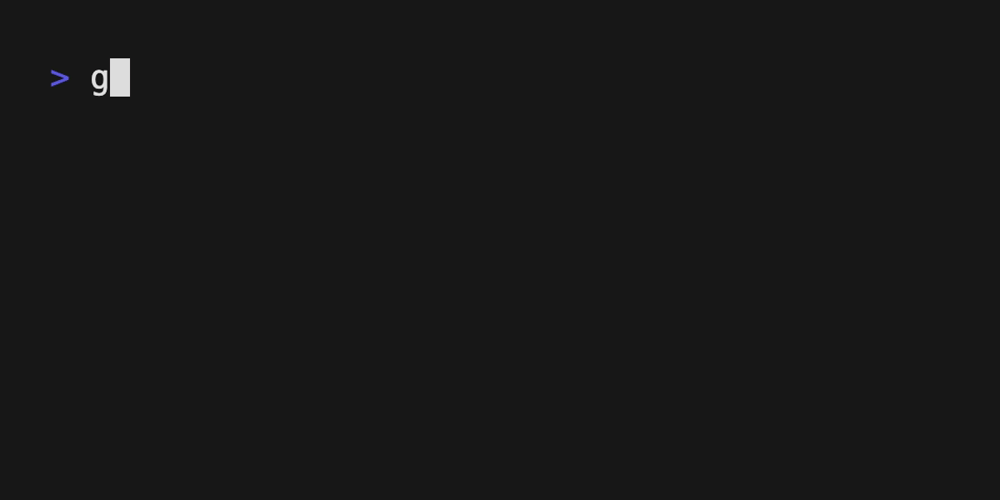

# spinner

[](https://hex.pm/packages/spinner)
[](https://hexdocs.pm/spinner/)



Animated progress spinners for your console.

Works on both Erlang and JavaScript runtimes.
```sh
gleam add spinner
```
```gleam
import spinner
import gleam/io
import gleam_community/ansi

pub fn main() {
  let spinner =
    spinner.new("Reticulating 3-Dimensional Splines")
    |> spinner.with_colour(ansi.yellow)
    |> spinner.start

  // Do some stuff while the spinner runs...

  // The spinner text can be changed
  spinner.set_text(spinner, "Collecting Meteor Particles")

  // Finish it when you're done
  spinner.stop(spinner)
  io.println("Done!")
}
```

Further documentation can be found at <https://hexdocs.pm/spinner>.
